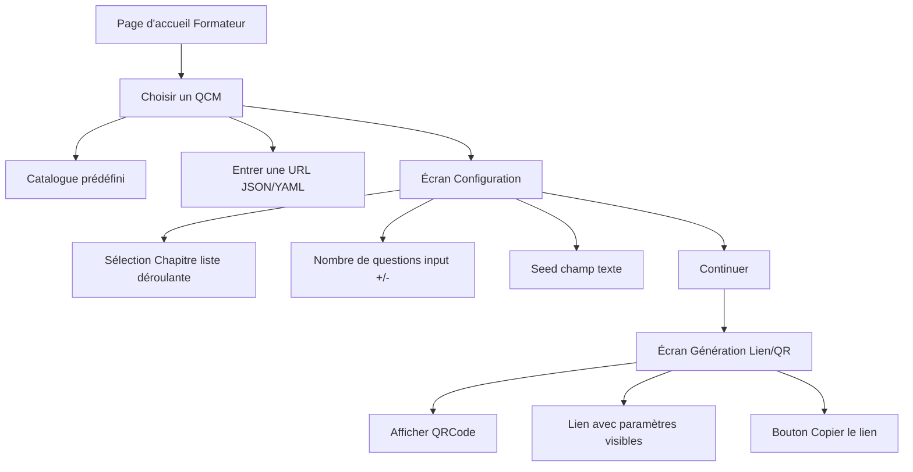

# Wireframe – Parcours Formateur (QCM en ligne)

## Description

Le parcours formateur permet de :

1. Choisir un QCM (catalogue prédéfini ou URL JSON/YAML)
2. Configurer le QCM (chapitre, nombre de questions, seed)
3. Générer un lien et un QRCode à partager aux stagiaires

---

## Diagramme (Mermaid)

---

## Éléments clés des écrans

### Écran d’accueil formateur

- Bouton : **Configurer ton QCM**

### Choix du QCM

- Option 1 : **Catalogue prédéfini**
- Option 2 : **Entrer une URL JSON/YAML**

### Configuration

- **Chapitre** : liste déroulante (remplie avec les chapitres du fichier choisi)
- **Nombre de questions** : input numérique avec boutons +/-
- **Seed** : champ texte (placeholder “Ex: 1234”)
- Bouton : **Continuer**

### Génération du lien

- QRCode généré automatiquement
- Lien avec paramètres (ex: `...?url=...&questions=10&seed=1234`)
- Bouton **Copier le lien**
