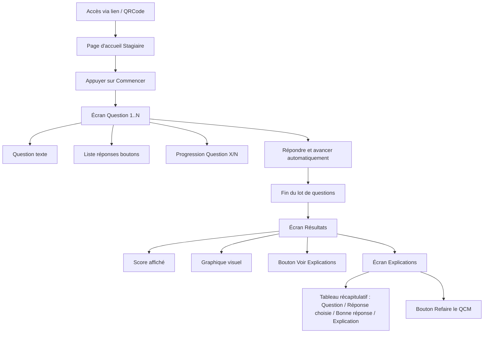

# Wireframe – Parcours Stagiaire (QCM en ligne)

## Description

Le parcours stagiaire permet de :

1. Accéder au QCM via un lien ou un QRCode donné par le formateur
2. Lire une page d’accueil simplifiée du QCM
3. Répondre aux questions en mode linéaire forcé
4. Voir un écran de résultats (score + graphique)
5. Consulter un tableau d’explications
6. Refaire le QCM si souhaité

---

## Diagramme (Mermaid)

---

## Éléments clés des écrans

### Accès au QCM

- QRCode ou lien généré par le formateur

### Page d’accueil stagiaire

- Texte d’introduction
- Bouton : **Commencer**

### Questions (mode linéaire forcé)

- Une seule question par écran
- Réponses sous forme de boutons
- Progression affichée (ex: Question 3/10)
- Passage automatique à la question suivante après validation

### Résultats

- Score global (ex: 7/10)
- Graphique visuel (camembert ou barres)
- Bouton : **Voir explications**

### Explications

- Tableau avec :
  - Question
  - Réponse choisie
  - Bonne réponse
  - Explication
- Bouton : **Refaire le QCM**
